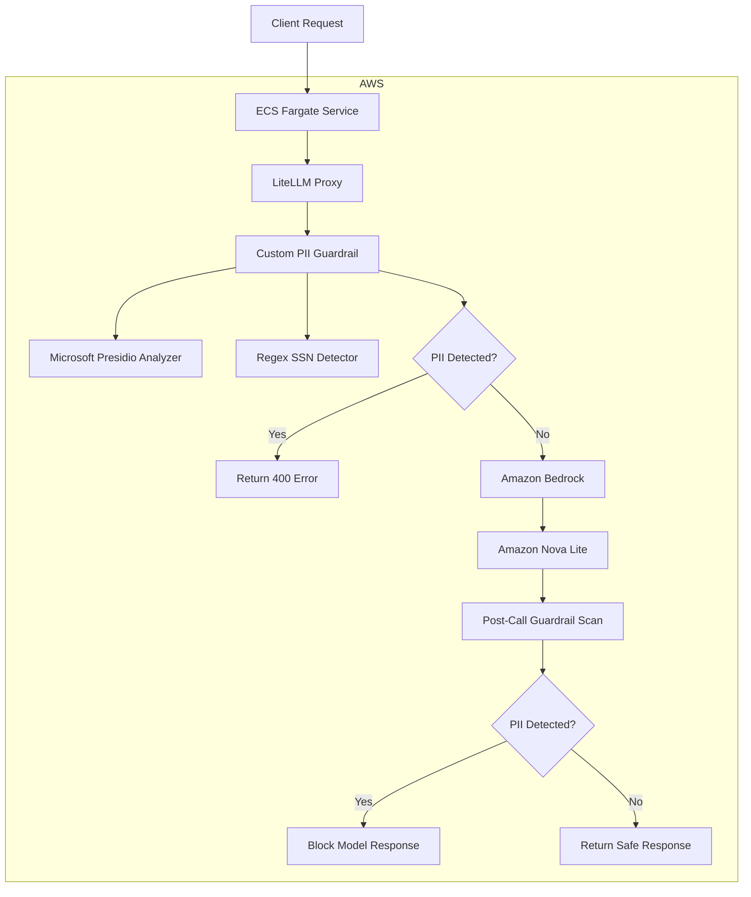

# Architecture Overview

This project deploys LiteLLM to AWS ECS Fargate with a custom PII detection guardrail that intercepts both prompt input and model output before sensitive data can leave the system.

The solution integrates:
- LiteLLM proxy
- custom Python guardrail hooks
- Microsoft Presidio
- AWS ECS Fargate
- Amazon Bedrock

## High-Level Architecture



## Request Lifecycle

### 1. Client Request

A client sends a request to the LiteLLM proxy endpoint:

```txt
/v1/chat/completions
```

### 2. LiteLLM Guardrail Hook

LiteLLM invokes the custom guardrail before the Bedrock request executes.

The implementation uses:
- `async_pre_call_hook`
- `async_post_call_success_hook`

This allows interception of:
- prompt input
- model output

### 3. PII Detection

The guardrail extracts message text and sends it through:
- Microsoft Presidio
- custom regex detection

Current detections:
- email addresses
- US Social Security Numbers

### 4. Guardrail Decision

If PII is detected:
- the request is blocked
- LiteLLM returns HTTP 400
- the Bedrock request never executes

If no PII is detected:
- the request proceeds to Bedrock

### 5. Bedrock Model Invocation

LiteLLM routes the request to:

```txt
bedrock-amazon-nova-lite
```

### 6. Output Validation

After model generation:
- the response content is scanned again
- model output containing PII is blocked before returning to the client

## AWS Deployment Architecture

The deployment uses:
- Docker containerization
- Amazon ECR
- ECS Fargate
- CloudWatch logging

### Deployment Flow

```txt
Local Docker Build
    ↓
Amazon ECR
    ↓
ECS Task Definition
    ↓
ECS Fargate Service
    ↓
LiteLLM Runtime
    ↓
Amazon Bedrock
```

## Runtime IAM Design

Two IAM roles are used:

### ECS Execution Role

Used by ECS to:
- pull images from ECR
- write logs to CloudWatch

### ECS Runtime Task Role

Used by the LiteLLM application runtime to:
- authenticate to Bedrock
- invoke model APIs

Without the runtime task role:
- Bedrock authentication fails
- ECS containers still start successfully

## Security Design

PII blocking occurs before the Bedrock request executes.

This minimizes:
- accidental data exposure
- sensitive prompt leakage
- downstream model processing of regulated data

The implementation intentionally blocks requests early in the request lifecycle.

## Production Considerations

For interview scope, the deployment uses:
- ECS Fargate
- public task IP
- direct service exposure

Recommended production improvements:
- Application Load Balancer
- TLS termination
- private subnets
- Secrets Manager
- CloudWatch alarms
- CI/CD pipeline
- WAF or API Gateway